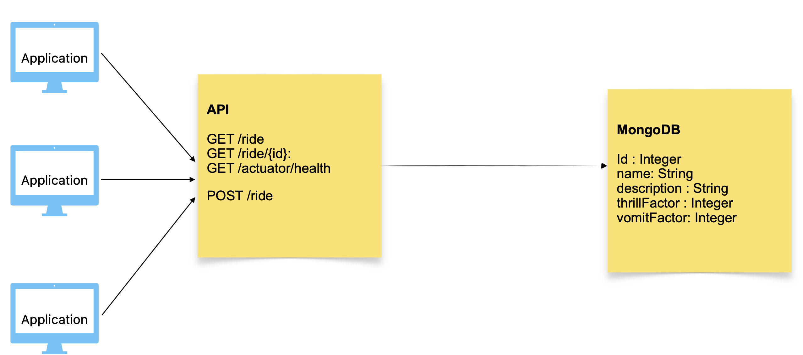
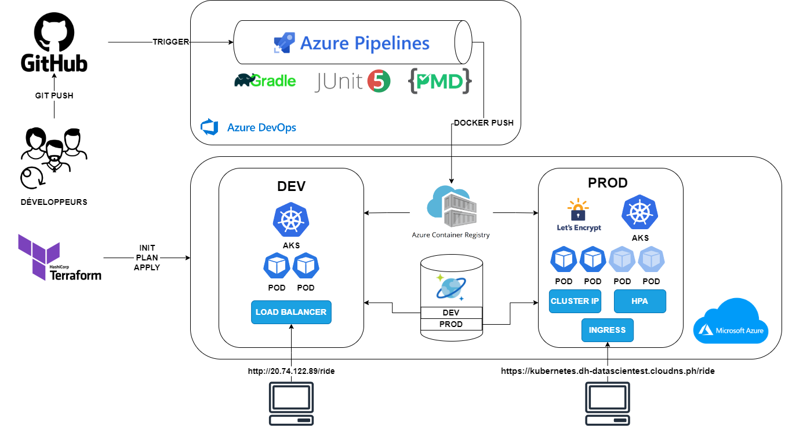

# 🎢 Projet Theme Park

## 👤 Mathias Berlancourt, Bilal Fitas, David Heang

### Etat initial du projet

Application Spring Boot (Java) permettant de répertorier les manèges d’un parc
d’attractions. Ces données sont stockées dans la RAM (in-memory).
Cette application se présente sous la forme d’une API avec 4 endpoints:

- GET /ride : permet de retourner toutes les attractions

  - Renvoie un array JSON avec toutes les attractions

    ```json
    [
      {
        "id": 1,
        "name": "Rollercoaster",
        "description": "Train ride that speeds you along.",
        "thrillFactor": 5,
        "vomitFactor": 3
      },
      {
        "id": 2,
        "name": "Log flume",
        "description": "Boat ride with plenty of splashes ",
        "thrillFactor": 3,
        "vomitFactor": 2
      },
      {
        "id": 3,
        "name": "Teacups",
        "description": "Spinning ride in a giant tea-cup.",
        "thrillFactor": 2,
        "vomitFactor": 4
      }
    ]
    ```

- GET /ride/{id}: permet de retourner l’attraction correspondant à id

  - Exemple avec id = 1

    ```json
    {
      "id": 1,
      "name": "Rollercoaster",
      "description": "Train ride that speeds you along.",
      "thrillFactor": 5,
      "vomitFactor": 3
    }
    ```

  - Exemple avec id = 4

    ```json
    {
      "timestamp": "2023-07-29T10:04:15.128+00:00",
      "status": 404,
      "error": "Not Found",
      "path": "/ride/4"
    }
    ```

- POST /ride: permet de créer une nouvelle attraction

  - Le body de la requête doit contenir les informations demandées dans le format JSON:

    ```json
    {
      "name": "Monorail",
      "description": "Sedate travelling ride.",
      "thrillFactor": 2,
      "vomitFactor": 1
    }
    ```

  - Exemple d’une bonne requête, l'attraction créée est renvoyée:

    ```json
    {
      "id": 4,
      "name": "Monorail",
      "description": "Sedate travelling ride.",
      "thrillFactor": 2,
      "vomitFactor": 1
    }
    ```

  - Exemple d’une mauvaise requête:

    ```json
    {
      "timestamp": "2023-07-29T10:06:20.403+00:00",
      "status": 400,
      "error": "Bad Request",
      "path": "/ride"
    }
    ```

- GET /actuator/health: permet d'interroger l’état de santé de l’application

  ```json
  {
    "status": "UP"
  }
  ```

Les données sont de la forme:

```java
Long id;
String name;
String description;
int thrillFactor;
int vomitFactor;
```

### UML



### But du projet

Nous devions appliquer les principes DevOps à notre projet. Ce dernier devait donc être mis sur un pipeline CI/CD afin d'être déployé sur un serveur web.

### Schéma du pipeline



### Présentation du choix des outils

- GitHub: Propriété de Microsoft donc intégration facilitée avec les outils Azure.
- Terraform
- Azure DevOps: Rassemblement de tous les outils nécessaires
  - Azure Boards: Plutôt que Trello
  - Azure Pipelines: Plutôt que Jenkins ou Gitlab-CI
- Azure Cloud:
  - Cosmos DB avec API MongoDB
  - Azure Container Registry (ACR)
  - Azure Kubernetes Services (AKS)

### Présentation snippets yaml du pipeline

- Déclencheur

  ```yaml
  trigger:
    branches:
      include:
        - main
  ```

- Construction

  ```yaml
  - task: Gradle@3
    displayName: Build JAR file and run unit tests
    inputs:
      gradleWrapperFile: "gradlew"
      tasks: "build"
  ```

  ```yaml
  - task: Docker@2
    displayName: Build and Push to ACR registry
    inputs:
      command: buildAndPush
  ```

- Assurance Qualité

  ```yaml
  jobs:
    - deployment: Deploy
      displayName: Deploy to Test cluster
      pool:
        vmImage: $(vmImageName)
      environment: "DevTest.default"
  ```

  ```yaml
  - task: KubernetesManifest@0
    displayName: Deploy to DevTest AKS cluster
    inputs:
      action: deploy
  ```

- Déploiement

  ```yaml
  jobs:
    - deployment: Deploy
      displayName: Deploy to Production cluster
      pool:
        vmImage: $(vmImageName)
      environment: "Prod.default"
  ```

### Problèmes rencontrés, solutions trouvées

Non familiarité avec le langage Java et le framework Spring Boot: Recherche google concernant les dépendances et JUnit

### Axes d'amélioration

Ajout d'une solution de monitoring telle que Prometheus et d'une solution de logging avec l'ensemble EFK (Elasticsearch, Fluentd, Kibana)
